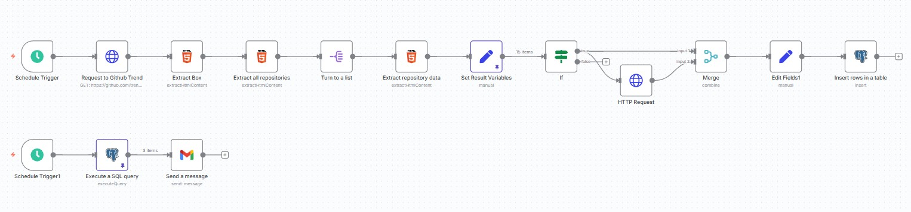

# GitHub Trending AI/LLM Repositories Workflow (n8n)

This repository contains an **n8n workflow** that automatically fetches trending GitHub repositories related to AI/LLM topics, processes the data, stores it in a Postgres database, and sends a weekly summary email with the top repositories.

---

## 📝 Workflow Overview

The workflow performs the following activities:

1. **Schedule Trigger**
   - Runs on a configured schedule (daily or weekly).
   
2. **Fetch GitHub Trending Page**
   - HTTP Request node retrieves the HTML of [GitHub Trending](https://github.com/trending).

3. **Extract Repository Boxes**
   - HTML Extract nodes parse the page to get individual repository entries.

4. **Split & Transform Data**
   - SplitOut node separates repositories into individual items.  
   - Set nodes extract relevant fields:
     - `author`
     - `title`
     - `repository`
     - `description`
     - `url`
     - `stars`
     - `created_at`

5. **Filter AI/LLM Repositories**
   - If node filters repositories based on keywords:
     ```
     LLM, GPT, ChatGPT, Transformer, LangChain, RAG, MLOps, MLflow, AI Security, Cybersecurity
     ```

6. **Enrich Repository Data**
   - HTTP Request node queries GitHub API to fetch additional repository details (optional).

7. **Merge & Prepare for Database**
   - Merge node organizes and formats data for insertion.

8. **Insert Data into Postgres**
   - Postgres node inserts or updates records into the `trending_repos` table.

9. **Weekly Summary Email**
   - Gmail node sends the top N AI/LLM repositories of the week via email.

---

## 📂 Workflow Screenshot

> 

---

## 🗄️ Database Schema (Postgres)

The workflow inserts repository data into a table named `trending_repos`.  
Below is the recommended schema:

```sql
CREATE TABLE trending_repos (
    id SERIAL PRIMARY KEY,
    author TEXT NOT NULL,
    title TEXT NOT NULL,
    repository TEXT NOT NULL,
    url TEXT NOT NULL,
    description TEXT,
    stars INT,
    created_at TIMESTAMP NOT NULL,
    inserted_at TIMESTAMP DEFAULT NOW()
);
```

## ⚙️ Setup Instructions

1. **Import Workflow**

    - Open n8n → Import Workflow → select JSON file from this repository.

2. **Add Credentials**

    - GitHub API: Create a personal access token in GitHub and configure it in n8n.

    - Postgres: Add your database credentials (host, port, username, password, database).

    - Gmail/SMTP: Add OAuth2 or SMTP credentials to send emails.

3. **Adjust Schedule**

    - Configure Schedule Trigger nodes according to your preferred frequency.

4. **Verify Table**

    - Make sure the trending_repos table exists in your database with the schema above.

## 🖼️ Example Output

Below is an example of 3–5 repository entries the workflow would generate:
| Author    | Title             | Repository                  | Stars | URL                                                    | Description                                           |
|-----------|-----------------|-----------------------------|-------|--------------------------------------------------------|------------------------------------------------------|
| harry0703 | MoneyPrinterTurbo | harry0703/MoneyPrinterTurbo | 45416 | [Link](https://github.com/harry0703/MoneyPrinterTurbo) | Generate short videos with one click using AI LLM     |
| mlabonne  | llm-course        | mlabonne/llm-course         | 64133 | [Link](https://github.com/mlabonne/llm-course)         | Course to get into Large Language Models (LLMs)      |
| lobehub   | lobe-chat         | lobehub/lobe-chat           | 66385 | [Link](https://github.com/lobehub/lobe-chat)           | Open-source AI chat framework with multiple providers |

## Security & Privacy

- Credentials are not included in this repository.

- Do not commit API keys, database passwords, or personal email addresses.

- Placeholders are used in the workflow JSON. Add your own credentials after import.

## Customization

- Modify the If node filter to track other topics.

- Adjust the email template in the Gmail node.

- Change database table or add additional fields from GitHub API as needed.